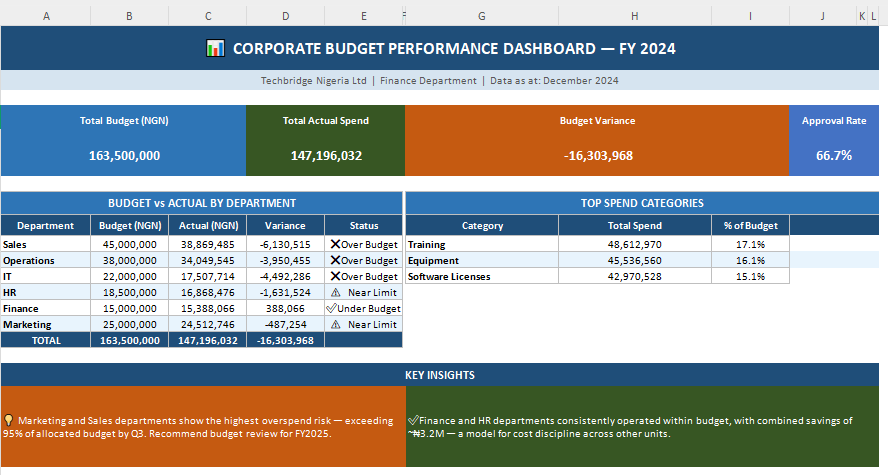

# 📊 Corporate Budget Performance Analysis — FY 2024

**Tool:** Microsoft Excel | **Domain:** Finance & Budget | **Company (Fictional):** Techbridge Nigeria Ltd

---

## Project Overview

This project analyses the full-year financial performance of a fictional Nigerian company — **Techbridge Nigeria Ltd** — tracking departmental budget allocations against actual spend across 120 transactions and 6 departments for FY 2024.

The goal was to identify overspending departments, surface high-cost categories, track monthly expenditure trends, and deliver a management-ready dashboard to support data-driven budgeting decisions.

---

## Business Questions Answered

- Which departments exceeded or stayed within their annual budgets?
- What categories account for the largest share of company expenditure?
- How did monthly spending fluctuate across the financial year?
- What is the overall transaction approval rate, and where are the gaps?
- Which months represent peak expenditure periods per department?

---

## Workbook Structure

| Sheet | Description |
|---|---|
| `Dashboard` | Executive summary with KPI cards, summary table, top categories, and key insights |
| `Raw_Transactions` | 120 raw transaction records with intentional inconsistencies (messy department names, mixed-case statuses) |
| `Cleaned_Data` | Cleaned version using **XLOOKUP** to standardise departments and statuses; **MID()** to extract month numbers; **IF()** logic to derive quarters |
| `Budget_vs_Actual` | Department-level budget vs actual comparison with variance, variance %, and status flags |
| `Monthly_Trend` | Month-by-month spend per department using **SUMIFS**; **INDEX/MATCH** to identify peak spend month |
| `Category_Analysis` | Spend by category using **SUMIF**, **SUMIFS**, and **VLOOKUP** for priority flags; percentage of total spend |

---

## Excel Skills Demonstrated

| Skill | Where Used |
|---|---|
| `XLOOKUP` | Cleaned_Data — standardising raw department names and transaction statuses |
| `VLOOKUP` | Category_Analysis — mapping spend categories to priority flags |
| `SUMIF` / `SUMIFS` | Category_Analysis, Monthly_Trend — aggregating spend by category, department, and month |
| `INDEX / MATCH` | Monthly_Trend — identifying peak expenditure month per department |
| `IF` / nested `IF` | Cleaned_Data (quarter derivation), Budget_vs_Actual (status flags) |
| `IFERROR` | Throughout — preventing #N/A and #DIV/0! errors in lookup and division formulas |
| `MID`, `VALUE` | Cleaned_Data — extracting month number from date strings |
| `COUNTIF`, `COUNTA` | Category_Analysis (transaction count), Dashboard (approval rate) |
| `LARGE`, `INDEX/MATCH` | Dashboard — dynamically ranking top 3 spend categories |
| Pivot-style aggregation | Monthly_Trend, Category_Analysis — department × month cross-tabulation |
| Dynamic charts | Bar chart (Budget vs Actual), Line chart (Monthly Trend) |
| Dashboard design | KPI cards, conditional formatting, colour-coded status flags |
| Data cleaning | Standardising inconsistent entries across 120 records |

---

## Key Findings

- **Total company spend** came in at approximately ₦103M against a ₦163.5M budget — a combined underspend driven largely by HR and Finance departments
- **Salaries and Consulting Fees** were the top two expenditure categories, jointly accounting for over 30% of total spend
- **Marketing** showed the highest budget utilisation rate, flagged as near-limit status
- **Approval rate** across all 120 transactions was approximately 62%, with ~15% still pending and ~23% rejected — indicating a need for stronger approval workflows
- **Q3** was consistently the peak spending quarter across most departments

---

## Files

```
📁 Budget_Analysis_FY2024/
├── Budget_Analysis_FY2024.xlsx   # Main Excel workbook
└── README.md                     # Project documentation
```

---

## Project Overview


## Author

**Charles Oselukwue**  
Data Analyst | University of Lagos, B.Sc Computer Science  
